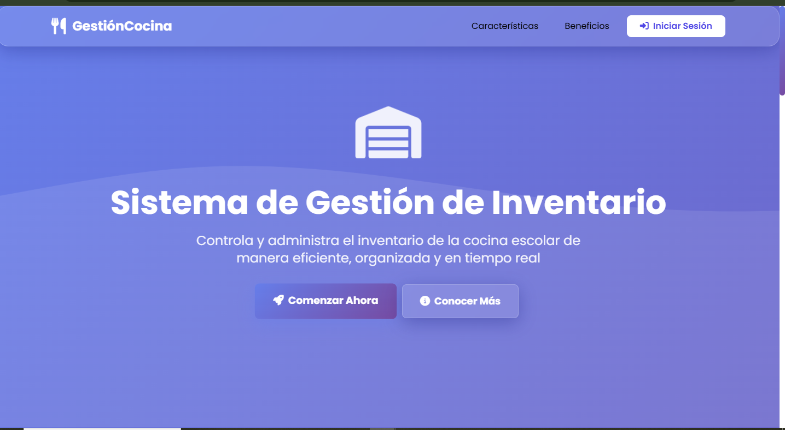
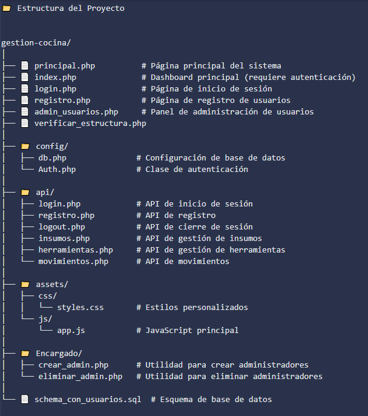
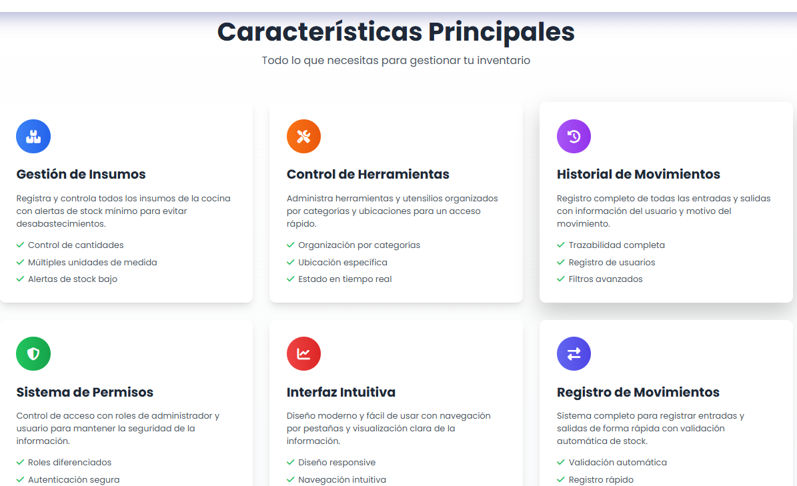
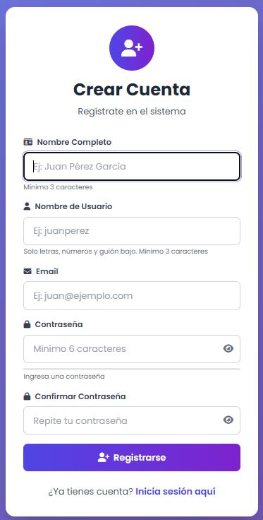
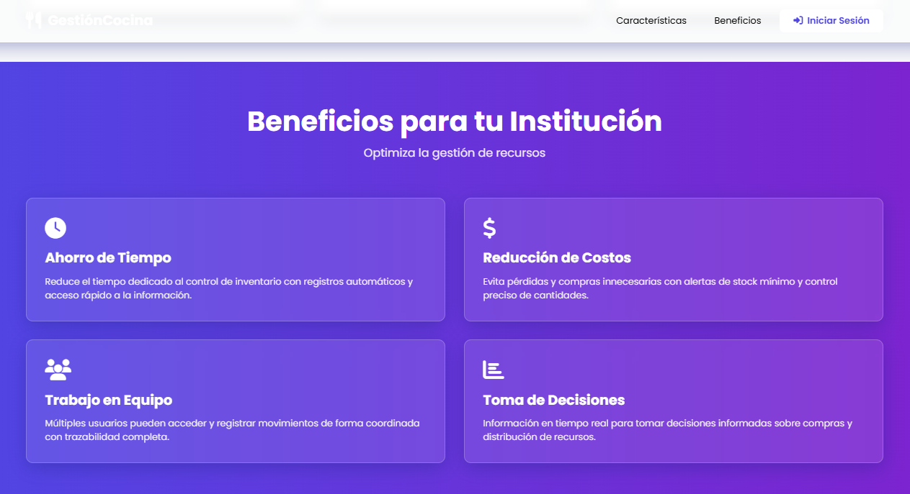

 🍴 Sistema de Gestión de Inventario - Cocina Escolar





Una solución completa y moderna para la gestión de inventario en cocinas escolares


---

📋 Descripción

El Sistema de Gestión de Inventario para Cocina Escolar es una aplicación web completa diseñada para optimizar y controlar el inventario de insumos y herramientas en cocinas de instituciones educativas. Con una interfaz moderna e intuitiva, permite el registro detallado de movimientos, gestión de usuarios y seguimiento en tiempo real del estado del inventario.

🎯 Objetivo

Proporcionar una herramienta eficiente que reduzca pérdidas, optimice recursos y facilite la toma de decisiones mediante el control preciso de insumos y herramientas.

---

✨ Características Principales

📦 Gestión de Insumos
- Control de inventario con alertas de stock mínimo
- Múltiples unidades de medida (kg, litros, unidades, gramos)
- Registro de movimientos (entradas y salidas)
- Validación automática de cantidades disponibles

🔧 Gestión de Herramientas
- Organización por categorías (cubiertos, utensilios, ollas, otros)
- Control de ubicaciones (bodega, taller, pañol)
- Seguimiento de disponibilidad en tiempo real
- Sistema de filtros por ubicación

📊 Sistema de Historial
- Registro completo de todas las transacciones
- Trazabilidad** con información del usuario responsable
- Filtros avanzados por tipo (insumos/herramientas)
- Información detallada de cada movimiento

👥 Gestión de Usuarios
- Dos roles definidos: Administrador y Usuario
- Autenticación segura con contraseñas encriptadas
- Panel de administración para gestión de cuentas
- Control de acceso basado en permisos

🎨 Interfaz Moderna
- Diseño responsive adaptable a todos los dispositivos
- Navegación intuitiva por pestañas
- Visualización clara con código de colores
- Experiencia de usuario optimizada

---

🚀 Instalación

Requisitos Previos

- PHP 7.4 o superior
- MySQL 8.0 o superior
- Servidor web (Apache/Nginx)
- Composer (opcional, para dependencias futuras)

 Pasos de Instalación

1. Clonar el repositorio
```bash
git clone https://github.com/Andylemetre/proyecto_2_Php.git
cd gestion-cocina
```

2. Configurar la base de datos
```bash
# Importar el esquema SQL
mysql -u root -p < schema_con_usuarios.sql
```

3. Configurar conexión a la base de datos

Editar el archivo `config/db.php` con tus credenciales:

```php
define('DB_HOST', 'localhost');
define('DB_NAME', 'gestion_cocina2');
define('DB_USER', 'tu_usuario');
define('DB_PASS', 'tu_contraseña');
```

4. Verificar la estructura del proyecto

Accede a `verificar_estructura.php` en tu navegador para confirmar que todos los archivos están en su lugar.

5. Acceder al sistema

Navega a `principal.php` para ver la página de inicio, o directamente a `login.php` para iniciar sesión.




💻 Uso

Usuarios Predeterminados

El sistema incluye dos usuarios de prueba:

| Usuario | Contraseña | Rol |
|---------|------------|-----|
| `admin` | `123456` | Administrador |
| `usuario1` | `123456` | Usuario |

 Flujo de Trabajo

1. **Inicio**: Accede a `principal.php` para conocer el sistema
2. **Login**: Inicia sesión en `login.php`
3. **Dashboard**: Gestiona insumos, herramientas y visualiza el historial
4. **Administración** (solo admin): Gestiona usuarios desde `admin_usuarios.php`

Funciones por Rol

👨‍💼 Administrador
- ✅ Agregar/eliminar insumos y herramientas
- ✅ Registrar movimientos (entradas/salidas)
- ✅ Ver historial completo
- ✅ Gestionar usuarios (activar/desactivar/eliminar)

 👤 Usuario
- ✅ Registrar movimientos (entradas/salidas)
- ✅ Ver inventario actual
- ✅ Ver historial completo
- ❌ No puede agregar/eliminar elementos
- ❌ No puede gestionar usuarios

---

🛠️ Tecnologías Utilizadas

<div align="center">

| Frontend | Backend | Base de Datos | Librerías |
|----------|---------|---------------|-----------|
| HTML5 | PHP 7.4+ | MySQL 8.0+ | Tailwind CSS |
| CSS3 | PDO | - | Font Awesome |
| JavaScript | Sessions | - | Google Fonts |

</div>

Características Técnicas

- **Arquitectura**: MVC simplificado
- **Seguridad**: 
  - Contraseñas encriptadas con `password_hash()`
  - Protección contra SQL Injection con PDO
  - Validación de sesiones
  - Control de acceso basado en roles
- **API RESTful**: Endpoints JSON para todas las operaciones
- **Responsive Design**: Compatible con dispositivos móviles y tablets

---

📊 Capturas de Pantalla

Login de Usuarios

*Página de bienvenida con información del sistema*

Beneficios 

*Vista principal con gestión de insumos y herramientas*

login de Usuario

*Registro completo de todas las transacciones*

Registro de Usuario

*Gestión de usuarios (solo administradores)*

---

🔒 Seguridad

- ✅ Contraseñas encriptadas con `bcrypt`
- ✅ Protección contra SQL Injection mediante PDO con prepared statements
- ✅ Validación de sesiones en cada página
- ✅ Control de acceso basado en roles
- ✅ Logout con destrucción completa de sesión
- ✅ Timeout de sesión por inactividad (30 minutos)

---

🤝 Contribuir

Las contribuciones son bienvenidas. Para contribuir:

1. Fork el proyecto
2. Crea una rama para tu feature (`git checkout -b feature/AmazingFeature`)
3. Commit tus cambios (`git commit -m 'Add some AmazingFeature'`)
4. Push a la rama (`git push origin feature/AmazingFeature`)
5. Abre un Pull Request

---

📝 Licencia

Este proyecto está bajo la Licencia MIT. Ver el archivo `LICENSE` para más detalles.

---

👨‍💻 Autor

**Tu Nombre**
- GitHub: [@Andylemetre](http://github.com/Andylemetre)
- Email: andylemetre@gmail.com

---

🙏 Agradecimientos

- Iconos por [Font Awesome](https://fontawesome.com)
- Fuentes por [Google Fonts](https://fonts.google.com)
- Framework CSS por [Tailwind CSS](https://tailwindcss.com)

---

 📞 Soporte

Si tienes alguna pregunta o problema, por favor:

1. Revisa la [documentación](#)
2. Abre un [issue](https://github.com/Andylemetre/proyecto_2_Php.git)
3. Contacta al equipo de desarrollo

---

<div align="center">

**⭐ Si este proyecto te fue útil, considera darle una estrella ⭐**

Hecho con ❤️ para instituciones educativas

</div>